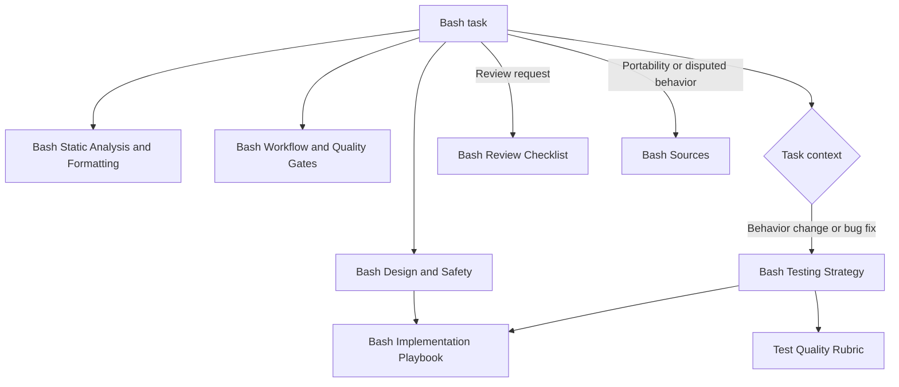

# Bash Guidelines Context Map

Use this map to load only the context needed for the current task. This guide is
for Bash. A script that promises POSIX `sh` compatibility must use the POSIX
language and be checked as `sh`, not as Bash with selected features omitted.

For deciding whether guidance belongs in Personalization, `AGENTS.md`, a
prompt, or a skill, use [[Codex Instruction Map]].

## Always load

1. [[Bash Design and Safety]]
2. [[Bash Static Analysis and Formatting]]
3. [[Bash Workflow and Quality Gates]]
4. The task-specific notes selected below

## Routing table

| Task signal | Load | Key outcome |
|---|---|---|
| Any Bash change | [[Bash Design and Safety]] + [[Bash Static Analysis and Formatting]] + [[Bash Workflow and Quality Gates]] | Match the declared Bash version; preserve arguments and filenames; pass syntax, static-analysis, and formatting gates |
| New executable or refactor | [[Bash Implementation Playbook]] | A small `main`-driven program with explicit inputs, dependencies, side effects, and exit behavior |
| Bug fix or behavior change | [[Bash Testing Strategy]] + [[Test Quality Rubric]] + [[Bash Implementation Playbook]] | Reproduce or specify behavior, prove the test is sensitive, then verify the fix |
| Test creation or test-quality review | [[Bash Testing Strategy]] + [[Test Quality Rubric]] | Verify status, stdout, stderr, filesystem effects, and adversarial inputs through the public entry point |
| Portability or interpreter change | [[Bash Sources]] | Choose Bash or POSIX `sh` explicitly and test every supported interpreter/platform |
| Destructive, privileged, secret-bearing, or untrusted-input script | [[Bash Design and Safety]] + [[Bash Testing Strategy]] + [[Bash Sources]] | Validate targets and arguments, minimize privilege, avoid code construction, and test safe failure |
| Code review | [[Bash Review Checklist]] plus [[Test Quality Rubric]] when tests are in scope | Findings tied to observable behavior, data loss, injection, portability, or failure-propagation risk |

## Precedence

Apply guidance in this order:

1. Explicit user requirements
2. Repository-local instructions and established patterns
3. The declared interpreter and supported platform contract
4. Core Bash notes in this vault
5. General preference

Do not preserve a local pattern that violates a strict safety rule. If an
interpreter, platform, public CLI, or destructive-operation contract is unclear,
surface the ambiguity before making a breaking or irreversible change.

## Minimal context bundles

### Small implementation or refactor

[[Bash Design and Safety]] → [[Bash Static Analysis and Formatting]] →
[[Bash Workflow and Quality Gates]] → [[Bash Implementation Playbook]]

### Behavior change or bug fix

Small implementation bundle + [[Bash Testing Strategy]] →
[[Test Quality Rubric]]

### Security-sensitive or destructive script

[[Bash Design and Safety]] → [[Bash Workflow and Quality Gates]] →
[[Bash Testing Strategy]] → [[Bash Sources]] →
[[Bash Implementation Playbook]]

### Review only

[[Bash Design and Safety]] → [[Bash Static Analysis and Formatting]] →
[[Bash Workflow and Quality Gates]] → [[Bash Review Checklist]] →
[[Test Quality Rubric]] when tests are in scope

## Source boundary

These notes synthesize Bash semantics, official tool documentation, an
established style guide, and security guidance. For exact semantics, version
requirements, or a disputed interpretation, use [[Bash Sources]].
