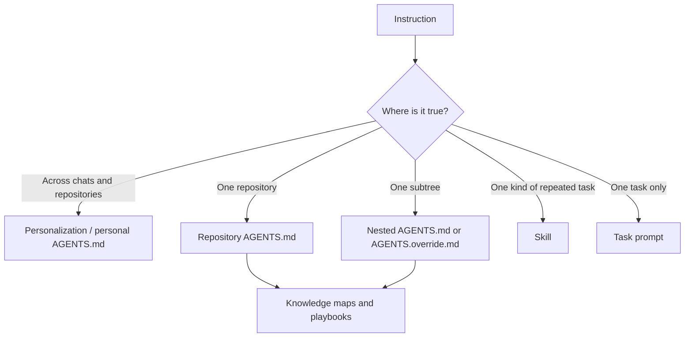

# Codex Instruction Map

Put each instruction at the narrowest scope where it remains true. This reduces repeated context, conflicts, and stale rules.

## Placement rules

| Surface | Put here | Keep out |
|---|---|---|
| Settings → Personalization | Stable collaboration preferences that apply everywhere | Repository commands, language-specific details, long checklists |
| Personal `AGENTS.md` | Durable cross-repository defaults and routing | Duplicates of Personalization or project-only rules |
| Repository `AGENTS.md` | Layout, commands, architecture, language policy, definition of done | Personal tone preferences and unrelated repositories |
| Nested `AGENTS.md` or `AGENTS.override.md` | Rules for a specific package or service | General repository rules already stated above |
| Skill | A repeated workflow with specialized references or scripts | One-off task context |
| Task prompt | Goal, relevant context, constraints, and done condition | Durable rules that should apply next time |

## Recommended chain

1. Personalization supplies a short working style.
2. Repository `AGENTS.md` supplies the concrete engineering contract.
3. The applicable context map loads deeper knowledge on demand.
4. The task prompt names the result and completion evidence.

Codex discovers `AGENTS.md` once per run/session, from global scope through the repository path. More specific files appear later and override broader guidance. Avoid duplicating the same rule at several layers.

## Language routing

- Python repository: repository `AGENTS.md` points to [[Python Guidelines Context Map]] or to a pinned copy available inside that repository.
- Go repository: use a repository-local map or skill based on [guidelines-golang](https://github.com/allexandrsokollov/guidelines-golang). The current vault does not yet mirror that repository.
- Mixed repository: put common rules at the root and language-specific routing in the closest relevant subtree.

## Verification

At the start of a fresh Codex task, ask:

> List the active instruction sources in precedence order. Summarize only the rules relevant to this task and identify conflicts.

Then give the task using:

> Goal: …  
> Context: …  
> Constraints: …  
> Done when: …

Related: [[Codex Instruction Strategy]] · [[Codex Product Sources]]
