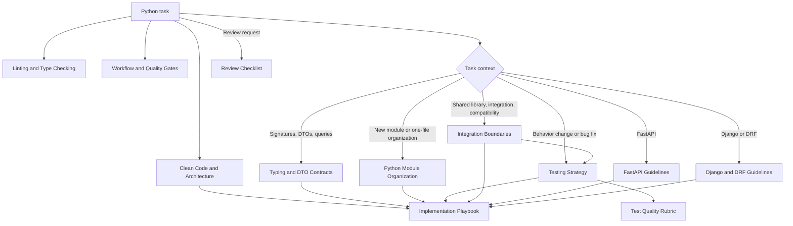

# Python Guidelines Context Map

Use this map to load only the context needed for the current task.

For deciding whether guidance belongs in Personalization, `AGENTS.md`, a prompt, or a skill, use [[Codex Instruction Map]].

## Always load

1. [[Clean Code and Architecture]]
2. [[Linting and Type Checking]]
3. [[Workflow and Quality Gates]]
4. The task-specific notes selected below

## Routing table

| Task signal | Load | Key outcome |
|---|---|---|
| Any Python change | [[Clean Code and Architecture]] + [[Linting and Type Checking]] + [[Workflow and Quality Gates]] | Keep code clean; run Ruff, mypy, and BasedPyright with the required baseline or stricter configuration; use Git only for read-only inspection |
| New code, refactor, architecture | [[Typing and DTO Contracts]] | Readable boundaries and explicit contracts |
| New module, one-file organization, module refactor | [[Python Module Organization]] + [[Typing and DTO Contracts]] | Predictable module order, visible public API, minimal import-time behavior, and a cohesive split when needed |
| Bug fix or behavior change | [[Testing Strategy]] + [[Test Quality Rubric]] + [[Implementation Playbook]] | Reproduce or specify behavior, prove the test is sensitive to the behavior, then verify the fix |
| Test creation or test-quality review | [[Testing Strategy]] + [[Test Quality Rubric]] | Score meaningful protection and defect sensitivity first, then use the total to guide improvement |
| Shared library, canonical factory, dependency integration | [[Integration Boundaries]] + [[Implementation Playbook]] | One owner and one production construction path |
| Cross-service transport, compatibility, observability | [[Integration Boundaries]] + [[Testing Strategy]] + [[Test Quality Rubric]] | Preserve boundary behavior and prove the end-to-end flow with sensitive tests |
| FastAPI endpoint, settings, errors | [[FastAPI Guidelines]] | Thin endpoints, typed settings, centralized errors |
| Django/DRF view, settings, errors | [[Django and DRF Guidelines]] | Thin views, Django settings, DRF exception mapping |
| Code review | [[Review Checklist]] plus [[Test Quality Rubric]] when tests are in scope, [[Python Module Organization]] when file structure is in scope, and the relevant framework note | Findings tied to observable risk and strict rules |
| Unclear or conflicting rule | [[Interpretation Notes]] | Apply documented precedence; surface ambiguity |

## Precedence

Apply guidance in this order:

1. Explicit user requirements
2. Repository-local instructions and established patterns
3. Applicable framework note
4. Core notes in this vault
5. General preference

Do not use a local pattern to justify a behavior that an applicable strict rule explicitly forbids. If rules genuinely conflict or would change a public contract, stop and surface the conflict.

## Minimal context bundles

### Framework-agnostic change

[[Clean Code and Architecture]] → [[Linting and Type Checking]] → [[Workflow and Quality Gates]] → [[Typing and DTO Contracts]] → [[Testing Strategy]] → [[Test Quality Rubric]] → [[Implementation Playbook]]

### Module creation or organization

[[Clean Code and Architecture]] → [[Linting and Type Checking]] →
[[Workflow and Quality Gates]] → [[Python Module Organization]] →
[[Typing and DTO Contracts]] → [[Implementation Playbook]]

### FastAPI change

Framework-agnostic bundle + [[FastAPI Guidelines]]

### Django or DRF change

Framework-agnostic bundle + [[Django and DRF Guidelines]]

### Shared infrastructure or cross-service integration

[[Clean Code and Architecture]] → [[Linting and Type Checking]] → [[Workflow and Quality Gates]] → [[Integration Boundaries]] →
[[Testing Strategy]] → [[Test Quality Rubric]] → [[Implementation Playbook]]

### Review only

[[Clean Code and Architecture]] → [[Linting and Type Checking]] → [[Workflow and Quality Gates]] → [[Review Checklist]] → [[Test Quality Rubric]] when tests are in scope → relevant core/framework note

## Source boundary

These notes are a retrieval-oriented summary. For exact wording, examples, or a disputed interpretation, use [[Upstream Sources]] and [[Interpretation Notes]].
